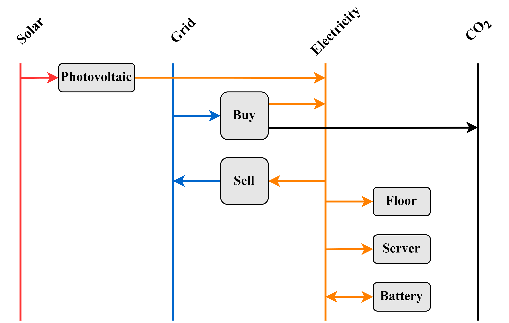

# Online Model Predictive Control Framwork (MPC)
(Master's Thesis by Benedikt Fuchsgruber, 2024)

## Learning Objectives
* Learn the structure of MPC and the online execution
* Get familiar with the topic 'IoT' and its advantages
* Learn about forecasting values with AI / NN
* Translate the energy system of the CoSES lab into a mathematical optimization problem
* Get an optimized operation strategy for controllable DERs

## Targets
* Predict behaviour for the next time step $t_{\text{step}} = 15$ min
* Perform MPC with past data over the last $t_{\text{past}} = 48$ h
* Control the BSS with the target value of timestep [-2]

## Mathematical background
* General optimization problem
$$ \min\limits_{x} \quad c^{T} \cdot x $$
$$ \text{s.t.}     \quad Ax \leq b  $$
* Variables
$$ C = \{ C_{\text{bss}}, \, C_{\text{pv}}, \,  C_{\text{grid}} \} $$
$$ \text{with} \quad c \in C $$
$$  P = \{ P_{\text{bss}}, \, P_{\text{pv}}, \,  P_{\text{grid}} \} $$
$$ \text{with} \quad x \in P $$
* Time domain
$$  t \in T = \{ 0, \, 1, \, ... , \, 192 \} \quad 1/4 \, \text{h} $$
$$ T_{\text{m}} = T \setminus \{0\} $$

* Cost function
$$ \zeta = \sum_{t \, \in \, T_{\text{m}}} (   \underbrace{C_{\text{grid,t}} \cdot P_{\text{grid,t}}}_\text{Grid} + \underbrace{C_{\text{bss,t}} \cdot P_{\text{bss,t}}}_\text{Battery} + \underbrace{C_{\text{pv,t}} \cdot P_{\text{pv,t}}}_\text{PV}   ) $$

## Getting started

* Clone the repository to your local machine
* Download a solver like glpk
* Define the solver path in 'run_mpc.ipynb'
* run 'run_mpc.ipynb' with a Jupyter Notebook environment
